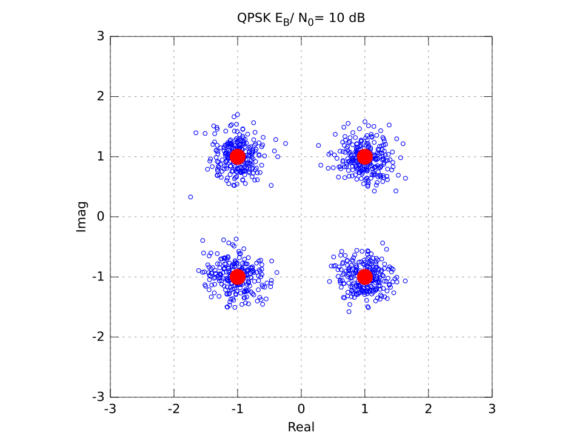

# Teoría de las Comunicaciones 2017 - Trabajo Práctico de Simulación

Adrián Pardini - 54024

\pagebreak

## Parte 1 - Sistemas en canal AWGN, sincronismo de portadora.

El objetivo del presente trabajo consiste en simular el desempeño de sistemas de modulación digitales en un canal AWGN y
contrastarlos con lo esperado teóricamente.

Con el fin de reducir los requerimientos de cómputo y almacenamiento en las simulaciones se asume que el canal no
posee distorsión y su único efecto es añadir ruido.

Bajo esas condiciones pueden eliminarse los procesos de modulación y demodulación y trabajar en espacio de señal.

### Ejercicio 1

En primer lugar se visualizan los símbolos de esquemas BPSK, QPSK y QAM16 junto con 250 realizaciones de cada uno
afectados por ruido con una relación $E_{b} / N_{0} = 10 dB$.

Se desarrollaron por cada uno módulos de codificación que toman bits en vectores fila y devuelven los símbolos con una
energía promedio por bit unitaria a fin de simplificar cálculos posteriores.

\pagebreak

Luego se analizó el desempeño de cada uno en presencia de ruido hasta lograr una probabilidad de error de bit igual o
menor a $10^{-5}$ para $E_{b} / N_{0}$ ente 0 dB y 20dB.

Para determinar la probabilidad de error en cada caso se parte de símbolos correspondientes a cien mil constelaciones
completas, se los afecta con ruido y demodula en forma repetida hasta lograr cien o más errores de bit en total. De esta
forma se reduce notablemente el tiempo total frente a una búsqueda por fuerza bruta.

### BPSK

En este caso la probabilidad de error de bit es (exacta):

$$ P_{eb} = Q\left( \sqrt{ \frac{2 \cdot E_{b}}{N_{0}} } \right) $$

Se observa un alto grado de similitud entre los valores experimentales y teóricos.

\pagebreak

### QPSK

En este caso la probabilidad de error de bit también es

$$ P_{eb} = Q\left( \sqrt{ \frac{2 \cdot E_{b}}{N_{0}} } \right) $$

considerando al sistema como dos sistemas BPSK trabajando en paralelo y cada uno independiente del otro respecto a los
efectos del ruido.

Nuevamente se observa un alto grado de similitud entre los valores experimentales y teóricos.

\pagebreak

### QAM16

Una constelación QAM cuadrada de M símbolos puede verse como dos sistemas PAM en cuadratura con $\sqrt{M}$ niveles cada
uno.

La probabilidad de recibir un símbolo correcto es:

$$ P_{c} = \left( 1 - P_{\sqrt{M}} \right) ^ 2$$

Donde $P_{\sqrt{M}}$ es la probabilidad de error de un sistema PAM con la mitad de energía que la constelación original
y $\sqrt{M}$ niveles.

$$ P_{\sqrt{M}} = 2 \left( 1 - \frac{1}{\sqrt{M}} \right) \cdot Q \left( \frac{3}{M - 1} \frac{E}{N_{0}} \right) $$

En la expresión anterior E es la energía promedio del sistema QAM. Al haber 4 bits por símbolo y cada uno ser de energía
unitaria la relación $E / N_{0}$ es igual a $4E_{b} / N_{0}$

Finalmente la probabilidad de error de símbolo es:

$$ P_{M} = 1 - \left(1 - P_{\sqrt{M}} \right) ^ 2 $$

(Proakis, Digital Communications 5.2.79)

Al emplear un esquema de codificación Gray la diferencia entre símbolos adyacentes es de un solo bit. Asumiendo que la
mayoría de los errores sólo afectan la decisión hacia uno de los símbolos vecinos la probabilidad de error de bit es:

$$ P_{eb} = \frac{P_{M}}{4} $$

(cuatro bits por símbolo en el caso de QAM16)

En este caso se observa que los resultados teóricos y experimentales concuerdan para altas relaciones señal a ruido y
son ligeramente distintos para valores bajos de la misma.

